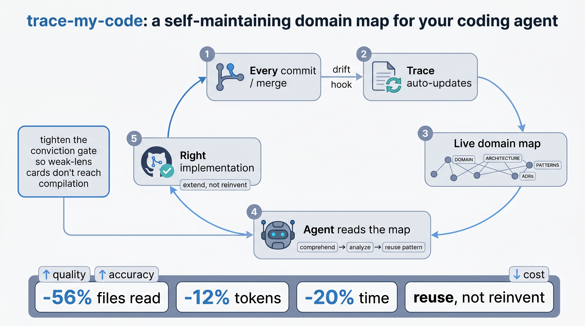

<p align="center">
  
</p>

<h1 align="center">trace-my-code</h1>

<p align="center">
  <em>The otter who already read your codebase — and learned your domain. So your agent understands what you mean, and reuses what's already there.</em>
</p>

<p align="center">
  <a href="https://github.com/kgohil/trace-my-code/blob/main/LICENSE"></a>
  <a href="https://github.com/kgohil/trace-my-code/releases/latest"></a>
  <a href="https://github.com/kgohil/trace-my-code/stargazers"></a>
  
  
  <a href="https://github.com/kgohil/trace-my-code/blob/main/CONTRIBUTING.md"></a>
</p>

<p align="center">
  <sub>An agent skill that keeps a living, navigable <strong>trace</strong> of your codebase — the domain language, business rules, architecture, flow, and reuse patterns — and makes the agent <strong>read it and reuse before it writes</strong>. Works in Claude Code, Cursor, Codex, Copilot, and ~20 other agents.</sub>
</p>

<p align="center">
  
</p>

<p align="center"><sub>Set it up once. Every commit keeps the domain map current; every feature request reads it. Quality and accuracy up, tokens and time down.</sub></p>

---

Most agents can read files. Fewer understand the thing the files are about.

You ask for a CSV export. A cold agent writes a new export module, pulls in a CSV library, and hand-rolls a date picker. Fine-looking work. Wrong shape. The repo already had an export pattern, the platform already had `<input type="date">`, and a one-line join was enough for the CSV.

That is the obvious failure: rebuilding what already exists.

The quieter, more expensive failure is when the agent does not understand your domain. You say, "tighten the conviction gate so weak-lens cards don't reach compilation," and it treats your vocabulary like fog. It guesses. It invents a nearby-looking mechanism. It ships something plausible and wrong.

trace-my-code gives the agent a maintained map of both: what your system already has, and what your words actually mean. Then it makes the agent use that map before it writes code. Oval glasses optional. The effect is not mystical; it is just what happens when the senior has already read the codebase and remembers the names.

## Before / after

A real request, phrased the way a domain expert actually says it — full of jargon a fresh agent has to decode from scratch:

> **"Tighten the conviction gate so weak-lens cards don't reach compilation."**

**Without the trace** — the agent crawls source to learn what a "card", "lens", "conviction gate", and "compilation" even are, then **builds a new parallel gate** from scratch:
> read **9 files** · _"I'll add a new `conviction-guard.ts` module…"_ · confidence 4/5

**With the trace** — the agent reads the map, understands the domain words, finds the gate that already exists, and **extends it**:
> read **4 files** · _"Rung 2 — extend `completion-guard.ts › evaluateCompletionGuard`; the per-card `confidence` / `sentiment` / `lensMode` it needs are already persisted — no new column. Safety floor: explicit thresholds + one runnable test kept."_ · confidence 5/5

Same request, same model. The trace agent read **56% fewer files**, spent **12% fewer tokens**, finished **20% faster**, and — the part that matters — **built the right thing by reusing the existing gate instead of bolting a second one beside it**. (Measured run, n=1; method in [`benchmarks/`](benchmarks/).)

Another shape of the same win — a CSV export request, where a cold agent over-builds:
> **Without:** _"add a `csv-stringify` dependency + a new `ExportService`"_ (a date-picker lib too).
> **With:** _"rung 4 — native `<input type=\"date\">`, no lib; rung 7 — one-line CSV join; extend the existing export procedure. Validation + auth-scoping kept."_

## How it works

Two pieces. The second is what keeps the first from becoming shelfware.

1. **The map** (persistent, kept current). Curated Markdown next to the code: `DOMAIN.md` (the contexts + language), per-module `ARCHITECTURE.md` (the flow, the **patterns & extension points**, the **invariants & absences**, the **external/out-of-repo** systems), and `ADRs` (the _why_). Symbol-anchored citations, Obsidian-vault compatible. This is where the agent learns that a "card", a "lens", a "gate", and "compilation" are not vibes. They are your system.
2. **The discipline** (understand-first, reuse-first). Before writing code, the agent reads the map, translates your request into the repo's actual domain and architecture, then climbs a ladder, stopping at the first rung that holds:

```
1. Does this need to exist at all?   → no: skip it (YAGNI)
2. Already in this codebase?         → reuse / extend it   (the map names the canonical example)
3. Standard library does it?         → use it
4. Native platform feature?          → use it
5. Installed dependency?             → use it
6. One line?                          → one line
7. Only then: the minimum new code that works
```

A **safety floor** is never on the chopping block: input validation, error handling that prevents data loss, security, accessibility, and anything explicitly requested. The ladder cuts code, never correctness.

The map keeps the trace from rotting (a drift hook flags or refreshes docs when the code they describe changes, and warns when a cited symbol is renamed). The discipline keeps the agent from free-associating. Together: the agent understands the request sooner, plans from a couple of reads, reuses what exists, and fixes shared code once.

## Early signal

Measured on a real monorepo (Next.js + Hono + Prisma), headless sub-agents, same model and task per pair, **n=1 per arm — illustrative, not a controlled benchmark** (the harness for rigorous numbers is in [`benchmarks/`](benchmarks/)):

The "tighten the conviction gate" request above, cold vs trace, as actually measured:

| Arm | Files read | Agent tokens | Wall time | Approach | Confidence |
|---|--:|--:|--:|---|:--:|
| No trace (cold) | 9 | 127,808 | 118s | **new** parallel gate | 4/5 |
| trace + reuse-first | **4** | **112,226** | **94s** | **extend** existing gate | **5/5** |
| **Δ** | **−56%** | **−12%** | **−20%** | reuse, not reinvent | +1 |

Across other tasks the same pattern holds: an earlier map-only version still mis-cited lines and **hallucinated a vendor** (said Langfuse; the repo uses PostHog); the current reuse-first version cites by symbol, finds callers a single grep misses, and chose a native feature over adding a library — without dropping a safety guard. Full method + how to reproduce: [`benchmarks/`](benchmarks/).

## Setup — one step, then it runs itself

**0. Install the skill.**

_Most agents — one command_ (Claude Code, Cursor, Gemini CLI, Copilot, Cline, Windsurf, opencode, … — detects your installed agents and wires the skill into each):

```bash
npx skills add kgohil/trace-my-code --skill trace-my-code --global
# alternative installer:  npx skillfish add kgohil/trace-my-code trace-my-code
```

`skills` ([vercel-labs](https://github.com/vercel-labs/skills)) **symlinks** the skill into each agent, so updates to the source reflect live; `skillfish` copies instead. Either works.

_Claude Code — native plugin (optional):_

```
/plugin marketplace add kgohil/trace-my-code
/plugin install trace-my-code@trace-my-code
```

_Codex — required (Codex is plugins-only):_

```bash
codex plugin marketplace add kgohil/trace-my-code
# then in codex:  /plugins  →  trace-my-code  →  install
```

> **Why Codex is separate:** Codex has no skills folder — it only loads **plugins**, so the cross-agent installers above don't reach it (they'd copy into `~/.codex/skills/`, which Codex ignores). The plugin route is the only one that works for Codex. Every other agent is covered by the single command above.

Then, in your repo, you do **one thing**:

**Run `/trace-my-code`** → it bootstraps the trace (Mode 0): `DOMAIN.md` + per-module `ARCHITECTURE.md` + seed ADRs, grounded in your code — **and wires the freshness hook for you** (a CI workflow if the repo has `.github/`, else a local pre-push hook). Curate the `_TODO` markers it leaves.

**That's it.** The drift hook is **on by default** in **rewrite** mode: when code in a traced area changes, it refreshes the affected docs and commits them to the **working/PR branch** (PR branch in CI, current branch locally) — **never directly to `main`**. No Claude credential in CI? It degrades to **flag** (a PR comment). Want warn-only everywhere? Set `TRACE_MY_CODE_MODE=flag`. Details + manual override: [`install.md`](skills/trace-my-code/install.md).

From then on it's automatic: **every change refreshes the trace, and every feature request reads it.** You write code; the map maintains itself.

## What you get

- **Domain comprehension** — the agent learns your jargon, concepts, business rules, flows, and architecture before it takes a swing at implementation.
- **Bootstrap** a first-draft trace on a fresh repo — grounded in code, `_TODO`-flagged where unverified. Never a blank page.
- **Author / maintain** `DOMAIN.md`, per-module `ARCHITECTURE.md`/`DATA_FLOW.md`, and ADRs, with symbol-anchored citations.
- **Reuse-first development** — the iron-law'd ladder + safety floor above.
- **Always current** — drift hook (git pre-push or CI) flags or surgically refreshes docs, and checks citations still resolve.
- **Obsidian-native** — frontmatter + `[[wikilinks]]`, so `docs/` opens as a navigable graph (no extra tooling). [How to view it](skills/trace-my-code/references/obsidian-format.md).
- **Multi-repo** — a service's trace links to the traces of services it calls, so the agent can walk a flow across microservices.

Full skill reference: [`skills/trace-my-code/README.md`](skills/trace-my-code/README.md).

## Design stance

Curated, not extracted. Grounded, not asserted. Domain-aware, not keyword-matching. Surgical, not regenerative. Reversible, not silent. The skill _writes and maintains_ the trace from your code; it never treats an auto-generated graph as the source of truth.

## Inspiration

- **[Andrej Karpathy's "LLM Wiki"](https://gist.github.com/karpathy/442a6bf555914893e9891c11519de94f)** — compile raw material into a navigable, interlinked wiki instead of re-deriving it every query. trace-my-code applies that shape to a codebase.
- **[ponytail](https://github.com/DietrichGebert/ponytail)** (MIT) — the "lazy senior dev" reuse ladder + safety floor. trace-my-code supplies the map that makes its "already in this codebase? reuse it" rung reliable in a large repo.
- **[superpowers:systematic-debugging](https://github.com/anthropics/claude-code)** — the gated-investigation shape (iron law, phases, red flags) the reuse-first mode borrows.

License: [MIT](LICENSE).
